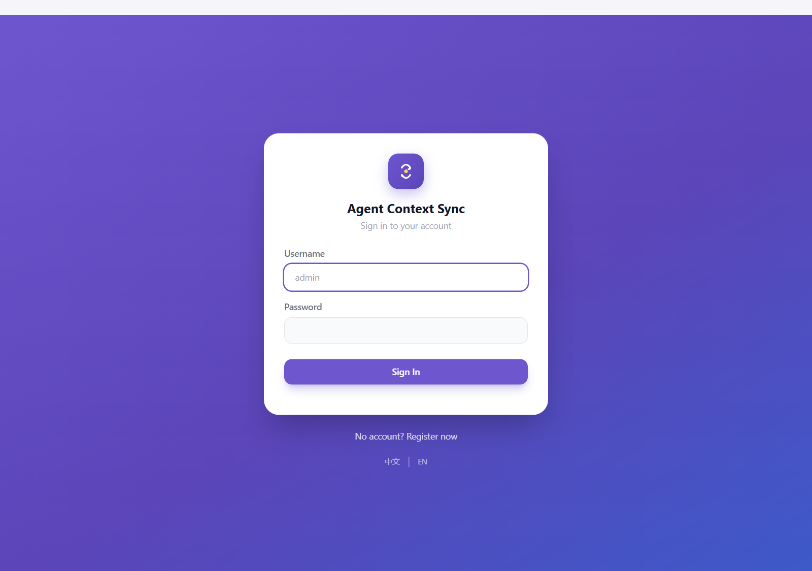
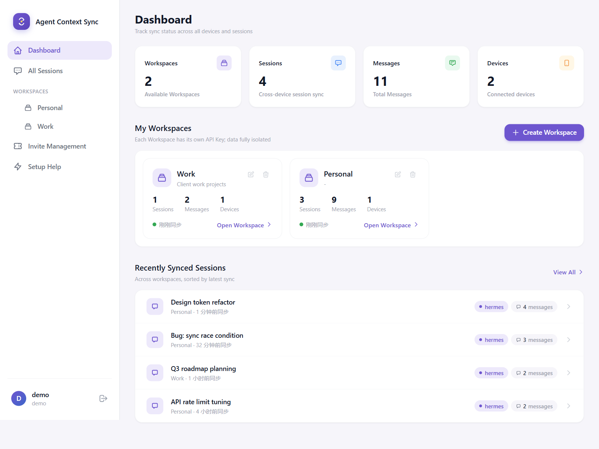
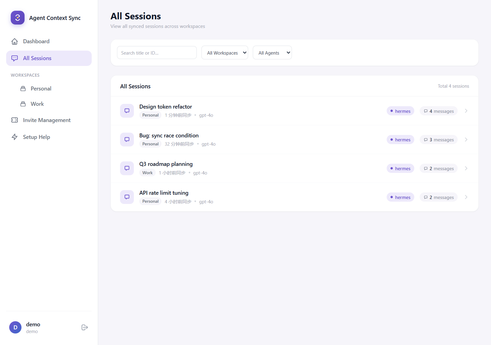
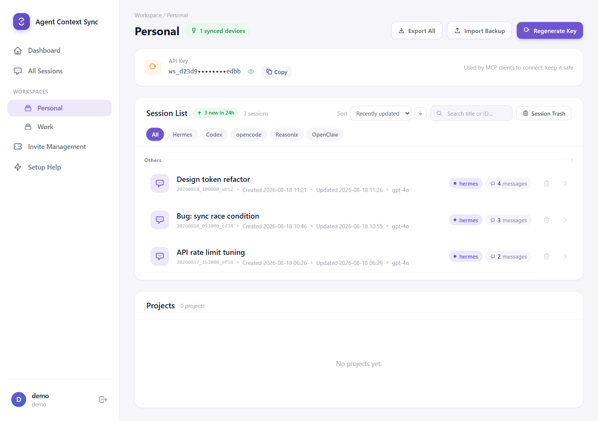
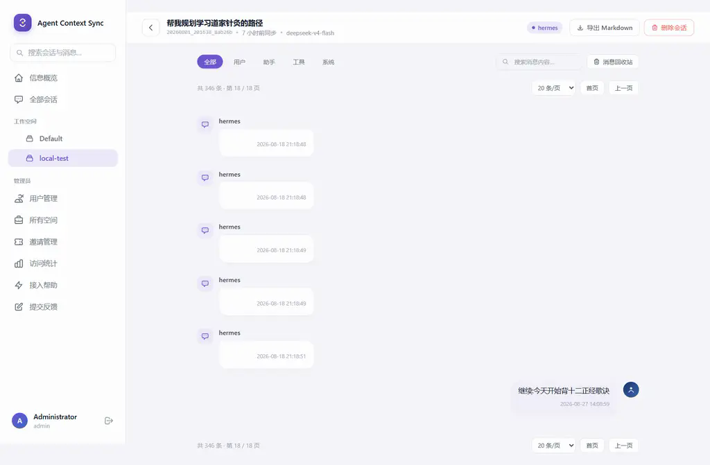

# Agent Context Sync

> **English**: [README.md](README.md) · **简体中文**: 本文档

[](LICENSE.zh-CN.md)
[](https://github.com/westsource/agentctxsync/actions/workflows/ci.yml)
[](mcp/)

> 官网：https://www.agentctxsync.com

跨设备、跨 Agent 同步会话的完整解决方案。支持多用户、多 Workspace 隔离，基于 PostgreSQL 后端，通过 MCP Server 实现 Agent 启动时自动同步。

## 主要特性

- **跨 Agent 同步**：Hermes / OpenAI Codex / opencode / Reasonix / OpenClaw / WorkBuddy 共享同一会话池。每个客户端拉取**整个会话池**（全部 Agent）并推送本地持有的全部会话，A 的会话可被 B 拉取并写入其本地存储；会话跨设备续写时只推送新增消息
- **子 agent 会话折叠**：Hermes 子 agent（委托任务）对话在同步时归并进主会话——主 agent 与子 agent 呈现为同一个会话，子 agent 消息在会话查看器中带「子 agent」徽标
- **多租户**：多用户 + 多 Workspace 隔离，每个 Workspace 独立 API Key；管理员可管理用户、邀请码与空间元数据，但**无法查看任何用户的空间内容、会话或消息**
- **自动同步**：启动时增量拉取（首次配对自动引导推送），之后周期性自动同步；分批避免超时、单写者锁安全、消息跨设备幂等去重
- **配额机制**：按用户会话存储上限 + Agent 白名单（`free` / `unlimited` 套餐），服务端对新建会话执法，策略存于数据库（免重启），带审计日志
- **Web 管理界面**：简体中文 / English 双语；信息概览、Workspace 管理、跨空间统一**全部会话**页、Markdown 会话查看器、回收站、导出/导入、问题反馈页、管理后台（用户 / 邀请 / 访问统计与设备明细——含各客户端最后同步版本）
- **项目同步**：Hermes 项目（侧边栏项目列表）随会话跨设备同步，同名合并 + 路径并集
- **数据安全**：会话/工作区一键导出（Markdown / JSON.gz）与导入；会话/消息可软删除（回收站可恢复）、置顶排序、标题/内容搜索
- **接入帮助**：内置接入帮助页，按 Agent 一键下载 MCP 客户端（含安装说明与注册命令；Key 保持占位符，转发包不泄露），并提供 WorkBuddy 与 Reasonix 引导流程（Reasonix 桌面版为 JSON 插件注册，含必需的 `env` 块）
- **客户端自动更新**：客户端定时从服务端拉取新版本，逐文件校验后自动替换，重启 Agent 即生效
- **开放注册**：注册默认开放（注册页含自托管数学验证码，无第三方依赖），邀请码可选；需要管控放量时可用邀请码（可选有效期、可撤销、支持 `?code=` 分享链接）

## 界面截图











## 支持的 Agent

| Agent | 本地存储 | canonical id | 写入约束 |
|-------|----------|-------------------|----------|
| Hermes | `%LOCALAPPDATA%\hermes`（POSIX：`~/.hermes`）下扫描全部档案：`state.db`（default）+ `profiles/<name>/state.db`（命名档案）(SQLite) | 裸 id（hermes 档案存于 `profile_name` 列，归属存于 `agent_type`） | SQLite 事务 |
| OpenAI Codex | `~/.codex/sessions/rollout-*.jsonl` | 裸 id | append-only；标题需追加 `session_index.jsonl`；codex 靠 backfill 感知新会话 |
| OpenCode | `$XDG_DATA_HOME/opencode/storage/` (JSON 文件) | 裸 id | `.tmp`+rename 原子写；外来会话经 idmap 分配 `ses_` id |
| Reasonix | `%APPDATA%\reasonix\sessions\*.jsonl` | 裸 id（文件名） | append-only；运行中（有锁文件）的会话跳过 |
| OpenClaw | `~/.openclaw/agents/<id>/agent/openclaw-agent.sqlite` | 裸 id | schema 自动探测（实验性） |
| WorkBuddy | `~/.workbuddy/projects/<slug>/*.jsonl` + `workbuddy.db` | 裸 id（uuid） | JSONL 追加 + SQLite upsert；cwd 目录自动创建；写入的会话需重启 WorkBuddy 后出现（启动时 MIGRATE 扫描识别） |

每个 Agent 独立部署一个 MCP 客户端实例（`HERMES_SYNC_AGENT` 选择），全部接入同一 Workspace 即实现互相同步。新增 Agent 只需实现一个适配器（见 [docs/ADDING_AGENT.md](docs/ADDING_AGENT.md)），服务端与同步引擎零改动。

## 快速开始

> 以下 `<SERVER_IP>` 均为占位符，请替换为你实际部署的服务器地址。

### 1. 服务器端部署

```bash
# 上传到目标服务器并执行
scp -r server/ scripts/ root@<SERVER_IP>:/tmp/hermes-sync/
ssh root@<SERVER_IP>
cd /tmp/hermes-sync/server
bash ../scripts/deploy-server.sh
```

部署完成后：
- API: `http://<SERVER_IP>:8765/health`
- Web UI: `http://<SERVER_IP>:8765/web/`
- 首次启动自动创建默认管理员 `admin`（随机密码，打印在服务端日志，**首次登录强制修改**）及其默认工作区（含 API Key，见服务端日志）

> 服务器 Python 依赖：`fastapi` `uvicorn` `psycopg2-binary` `jinja2` `markdown` `python-multipart`（`deploy-server.sh` 已包含，Markdown/Jinja2 用于 Web UI 渲染，python-multipart 用于 Web 表单解析）。
>
> 更详细的服务器部署、运维与备份说明见 [docs/server-deployment.md](docs/server-deployment.md)。

### 2. 注册用户与创建 Workspace（Web UI）

1. 打开 `http://<SERVER_IP>:8765/web/`，点击注册
2. 注册默认开放（注册页需通过自托管数学验证码），邀请码可选；如需限制注册，管理员可在 管理 → 邀请管理 页面创建邀请码（格式 `HSYNC-XXXXXXXX`），可设置有效期、备注，可随时撤销；也可复制带 `?code=` 参数的分享链接直接发给用户
3. 注册成功后自动创建「默认工作区」；也可以在信息概览点击 "+ 创建" 创建更多 workspace
4. 在 Workspace 详情页复制 API Key（格式 `ws_xxx`）

### 3. 本地 MCP 部署

**方式 A（推荐）**：登录 Web UI → 接入帮助（`/web/help`）→ 按你的 Agent 下载对应压缩包。按包内安装说明（README.md）解压、注册——注册命令中的 `<YOUR_API_KEY>` 需替换为帮助页中对应工作区的 API Key（下载包不再预填 Key，避免包被转发导致泄露）。完成后重启 Agent 即可。

> **Reasonix（桌面版）**：压缩包/帮助页附带 JSON 插件注册配置，粘贴到 `设置 → MCP与工具 → 添加服务器 → JSON`。`env` 块**必须完整**——缺 `HERMES_SYNC_AGENT` 会退回 hermes 适配器（扫错目录），缺 `HERMES_SYNC_API_KEY` 全部请求认证失败；`HERMES_SYNC_AUTO_UPDATE=0` 用于仓库直部署的客户端跳过更新检查。重启后插件随桌面自动启动（`auto_start: true`），启动约 8 秒后增量拉取，之后每 300 秒双向同步。CLI 等价写法：`config.toml` 中 `[[plugins]]` 块（`name/type/command/args/env/auto_start` 字段相同）。

**方式 B（手动）**：

```bash
# 选择 agent（hermes | codex | OpenCode | reasonix | openclaw | workbuddy），默认 hermes
export HERMES_SYNC_AGENT=codex

# 设置 workspace API key（格式 ws_xxx）
export HERMES_SYNC_API_KEY=ws_yourkeyhere

# 一键部署（注意：脚本内默认服务器地址为占位符，请设置 HERMES_SYNC_SERVER 为实际部署地址）
bash scripts/deploy-local-mcp.sh
```

> 每个 Agent 独立部署一份实例（各占一个 `HERMES_SYNC_AGENT` 与独立的锁文件），全部指向同一 Workspace API Key 即互相同步。新增 Agent 的接入流程见 [docs/ADDING_AGENT.md](docs/ADDING_AGENT.md)。
>
> MCP 客户端行为：启动时自动增量拉取一次；若远程为空（首次配对）自动推送本地数据完成引导；之后每 300 秒自动同步一次（可用 `HERMES_SYNC_INTERVAL` 调整）。

### 4. 迁移现有数据（可选）

将本地 Hermes `state.db` 中的历史会话推送到远程服务器：

```bash
python scripts/migrate-local-to-server.py ws_yourkeyhere http://<SERVER_IP>:8765
```

## 配置

### 服务器端环境变量

| 变量 | 说明 |
|------|------|
| `HERMES_SYNC_PG_DSN` | PostgreSQL 连接字符串 |
| `HERMES_SYNC_MASTER_KEY` | Master API key（非同步用） |
| `HERMES_SYNC_JWT_SECRET` | Web UI JWT 签名密钥 |
| `HERMES_SYNC_TOKEN_EXPIRE` | JWT 过期时间（小时，默认 24） |
| `HERMES_SYNC_PUBLIC_URL` | 对外公开地址（如 `https://www.example.com`），打包进客户端并展示在帮助页；未设置时客户端包默认取下载请求的来源地址 |

### 本地 MCP 环境变量

| 变量 | 默认值 | 说明 |
|------|--------|------|
| `HERMES_SYNC_AGENT` | `hermes` | 本地存储适配器：`hermes`/`codex`/`opencode`/`reasonix`/`openclaw`/`workbuddy` |
| `HERMES_SYNC_SERVER` | `http://<SERVER_IP>:8765` | 远程服务器地址（按实际部署配置） |
| `HERMES_SYNC_API_KEY` | - | **Workspace API Key**（必须，格式 `ws_xxx`） |
| `HERMES_SYNC_INTERVAL` | `300` | 自动同步间隔（秒） |
| `HERMES_SYNC_AUTO_SYNC` | `1` | 后台自动同步开关（`0` 关闭；手动工具调用仍可用） |
| `HERMES_SYNC_AUTO_UPDATE` | `1` | 客户端自动更新开关（`0` 关闭） |
| `HERMES_SYNC_UPDATE_INTERVAL` | `3600` | 更新检查间隔（秒，默认 1 小时） |

## 配额（可选）

- 每个用户带 `plan`（`free` / `unlimited`）；注册（无邀请码）授予 `free`，带邀请码注册按邀请码的授予套餐（默认 `unlimited`），管理员可创建授予 `free` 套餐的邀请码。默认 `free` 套餐的活跃会话上限为 300。
- 执法：`POST /push` 只对**新建会话**拦截——Agent 白名单 + 用户全局活跃会话数。已有会话的更新与拉取不受影响，降低配额不会破坏已同步的数据池。超限返回 403（`agent_not_allowed` / `quota_exceeded_sessions`）并记入审计日志。
- 策略存于数据库（`users.plan` + `quota_config`）：运营侧改动后下一次 push 即生效，无 API 耦合、无需重启。配额界面（侧边栏用量、邀请码套餐选择）在受限套餐可达时显示——存在授予 `free` 的邀请码或有 `free` 用户即显示（默认注册即授予 `free`，通常注册第一人后即出现）；界面隐藏时执法照常生效。
- 运维 SQL（调整限额、最小权限只读账号）见 [docs/server-deployment.md](docs/server-deployment.md)。

## 客户端自动更新

MCP 客户端内置自动更新：启动后约 1 分钟检查一次、之后每 1 小时检查一次，通过
服务端 `/api/client/manifest`（版本对比）与 `/api/client/download`（带 SHA256
清单的 zip）拉取新版本，逐文件校验后**就地原子替换**并保留上一版本备份
（`.bak-<版本>/`），**重启 Agent 后生效**（MCP server 无法自重启，也不打断
正在进行的会话）。

- 关闭：`HERMES_SYNC_AUTO_UPDATE=0`；调整间隔：`HERMES_SYNC_UPDATE_INTERVAL`
- **下载包内的服务器默认地址**：每个下载的客户端包，其 `HERMES_SYNC_SERVER` 代码默认值都会被设为提供下载的服务端地址（按请求来源），若服务端配置了 `HERMES_SYNC_PUBLIC_URL` 则使用该值。迁移存量客户端到新地址：在服务端设置 `HERMES_SYNC_PUBLIC_URL` 为新地址并 bump `CLIENT_VERSION`——客户端从旧地址（保持可达直到全部升级完）拉取新包，重启 Agent 后自动切换。
- 校验失败/网络不可达时保留旧文件，仅记录日志，不影响同步
- 回滚：将 `.bak-<版本>/` 中的文件复制回 `mcp/` 目录并删除 `.hermes-sync-version`
- **版本发布流程**：修改客户端后，同时 bump `mcp/updater.py` 与 `server/client_update.py`
  中的 `CLIENT_VERSION` 常量，部署服务端后所有客户端在下次检查时自动升级

## 多档案同步（Hermes profiles）

Hermes 桌面应用支持多档案（profile）：每个命名档案是**完全独立的存储目录**，各自拥有
独立的 `state.db`（default 在平台根，命名档案在 `<根>/profiles/<name>/`）。客户端**扫描
平台根下全部档案**并逐一同步，一个 MCP 实例即可覆盖本机所有档案，互不串档。

### 档案发现规则

```
平台根 <root>（只按平台默认位置，不读取 HERMES_HOME / active_profile）
├─ Windows: %LOCALAPPDATA%\hermes
└─ POSIX:   ~/.hermes

扫描:
├─ <root>/state.db                  → default 档案（裸 id，兼容存量）
└─ <root>/profiles/<name>/state.db  → 命名档案（如 magic），按名称排序
```

- **MCP 子进程不继承档案**：hermes 的档案切换通过进程内 ContextVar 实现，不会传递给
  MCP server 子进程环境变量，桌面端也不写 `active_profile` 标记、不传入 `HERMES_HOME`，
  因此客户端直接**扫描 `profiles/` 目录**发现全部档案，而不是解析「当前激活档案」。
- **单一 watermark**：增量拉取水位线保存在平台根 `<root>/.hermes-sync-watermark`，
  所有档案共用；每次拉取按服务端 `last_synced_at` 增量进行，不会串档。

### 会话 id 与隔离

| 档案 | canonical id | 说明 |
|------|--------------|------|
| default | 裸 id（`20260808_180012_0c275f`） | 存量兼容，行为不变 |
| 非 default（如 magic） | `20260808_180012_0c275f` | 档案存于 `profile_name` 列；id 全部裸 id，档案是列而非 id 的一部分 |

- 服务端区分档案：`profile_name` 列权威；旧前缀 id（`<profile>:<bare>`）由入站兼容层规范化。
- **Push 全量合并**：推送时读取本机全部档案的 `state.db`，default 会话保持裸 id，
  命名档案会话带 `profile_name` 字段，合并为一份列表上报（id 全部裸 id）。
- **Pull 按档案路由**：拉取时按 `profile_name` 字段路由回各档案的 `state.db`；本机不存在的档案
  （其他电脑独有的档案）直接跳过；其他 agent 的会话以完整 canonical id 存入 default 档案——每个客户端拉取**整个工作空间会话池**，并推送本地持有的全部会话（服务端按 canonical id 合并；`agent_type` 按会话归属保留、消息按 `(session_id, role, timestamp)` 去重，因此本地续写的其他 agent 会话只会把新增消息推上去）。

### 跨电脑同步示例

```
A 电脑: default + magic 档案     B 电脑: default + magic 档案

t1: A 只有 default；B 只有 default
    → 双方裸 id 会话互相合并，行为与单档案一致
t2: A 新建 magic 档案；B 尚未创建
    → A 推送 magic: 前缀会话；B 拉取时跳过（本机无 magic 档案）
t3: A、B 均有 magic 档案
    → 两侧 magic 会话互相合并（id 均带 magic: 前缀）；default 照常同步
```

> 注意：客户端只同步**本机已存在**的档案。某档案只存在于远端设备时，本机拉取会跳过
> 该档案的会话（watermark 正常推进）；本机创建同名档案后，该档案的历史会话即可从
> 服务端拉回。

### 项目同步（projects.db）

Hermes 桌面的项目（侧边栏项目列表）存储在**每档案独立的 `projects.db`**（
`<档案目录>/projects.db`），与 `state.db` 并存。客户端按档案遍历所有 `projects.db`，
实现跨设备项目同步：

- **Push**：读取本机所有档案的 `projects.db`，合并为 canonical 列表推送
  （default 档案 id 为裸 id，命名档案为 `<profile>:<id>`）。
- **同名合并**：同一 workspace 内 `(profile, slug)` 相同但 id 不同的项目，
  服务端合入**最早创建**的项目：folders 取并集，并记录 remap
  （`old_id → new_id`）供客户端收敛。
- **Pull**：拉取远程项目 + remap 记录，按 id 前缀路由回各档案的 `projects.db`；
  folders 增量合并（新路径插入、已有路径更新，不删除），slug 冲突时自动去重后缀。
- **Web 会话关联**：Web 工作空间页的项目列表会用会话的 `cwd` 对项目 folders
  做前缀匹配，展示每个项目下的会话（与 hermes 原生 `project_for_path` 逻辑一致；
  跨设备路径是各机器自己的，Web 展示为并集）。
- **工具**：`project_push` / `project_pull` 手动触发；周期同步（默认 300s）也会
  顺带同步项目。

## 数据保留与检索（删除 / 回收站 / 置顶 / 搜索）

- **删除 / 恢复（软删除 soft-hide）**：Web 会话列表与消息详情支持「删除 / 恢复」操作，数据**保留
  不删除**（软 `hidden` 标记）、完全可逆。被删除的项进入**回收站**：`/web/workspace/{id}/trash`
  （会话回收站）与 `/web/workspace/{id}/session/{sid}/trash`（消息回收站），可随时恢复。删除后：
  - 服务端 `/pull` 不再下发已删除的会话/消息（数据仍在服务端，恢复后重新下发）；
  - `/push` 更新已有行时不会重置其 `hidden` 标记；
  - 会话列表与消息查看器默认不显示已删除项；回收站页面可查看并恢复。
- **置顶排序**：会话列表按 `pinned` 置顶优先排序（📌 标记）。当前仅用于排序展示，
  暂无置顶管理入口。
- **搜索**：Workspace 会话列表 `?q=` 按标题 / id 模糊过滤；会话详情页 `?q=` 按消息内容
  模糊过滤（LIKE 通配符已转义，避免注入）。

## 服务器迁移流程

服务端地址的优先级：`config.yaml` 的 `HERMES_SYNC_SERVER` 环境变量 > `server.py`
代码默认值（当前为部署服务器地址）。客户端自动更新会连同新的默认地址一起下发。

**无缝迁移（推荐，旧服务器保持在线直到全部客户端更新完）**：
1. 在新服务器部署新版服务端（含新地址默认值），bump `CLIENT_VERSION`
2. 保持旧服务器在线（客户端更新仍需从旧地址拉取）
3. 等待各客户端完成自动更新（启动后 1 分钟 / 每 1 小时检查）
4. 各客户端重启 Agent 后自动连上新服务器
5. 确认无客户端仍连旧服务器后，再下线旧服务器

**旧服务器直接下线的场景**：客户端无法再从旧地址拉取更新，需要手动处理——
在各机器 `config.yaml` 的 `env` 段添加 `HERMES_SYNC_SERVER: http://新地址:8765`
（环境变量优先），或手动复制新版 `server.py` 到 `mcp/` 目录。

> **水位线跟随服务器身份**：增量拉取水位线记录其归属的服务器。客户端指向不同服务器时
> （环境变量或更新后的默认地址），水位线不匹配会自动触发全量重拉——旧服务器的残留
> 水位线绝不会压住新服务器上的会话。

## MCP 工具

| 工具 | 说明 |
|------|------|
| `sync_status`（别名 `hermes_sync_status`） | 查看同步状态（远程会话/消息数、设备最近同步时间） |
| `sync_pull`（别名 `hermes_sync_pull`） | 从远程拉取会话到本地（参数: `limit`，默认 50；`full`——忽略水位线全量拉取；后台增量拉取时按水位线分页获取全部） |
| `sync_push`（别名 `hermes_sync_push`） | 推送本地会话到远程（自动分批：会话数 + 消息数双上限，避免大请求超时） |
| `sync_full`（别名 `hermes_sync_full`） | 完整同步（先 push 再 pull） |
| `project_push` | 推送本地全部档案的 projects.db 项目到远程（同名合并由服务端处理） |
| `project_pull` | 从远程拉取项目到本地 projects.db（应用 remap、按档案路由） |

> `sync_*` 为中性工具名（所有 Agent 通用）；`hermes_sync_*` 为兼容别名，存量 Hermes 注册不受影响。

后台行为：
- 启动时自动**增量**拉取一次（延迟 8 秒避开宿主 Agent 启动/会话恢复的读高峰；本地
  `.hermes-sync-watermark` 水位线 + 5 分钟时钟容差）；远程为空时自动推送本地数据
  （新设备首次配对引导）
- 周期性自动同步（默认 300 秒）
- **水位线绑定服务器身份**：客户端指向不同服务器时自动全量重拉（见「服务器迁移流程」）
- **分批同步**：拉取每批 15 个会话分页；推送按会话数 + 消息数双上限分批，大批量同步不会超时
- **拉取写重试**：本地存储被宿主 Agent 占用时自动重试几次（每次快速失败，busy_timeout 5 秒）
- 单写者锁：双 `serve` 实例只允许一个进程运行后台同步，避免本地存储竞争；自动更新使用独立更新锁
- 消息去重基于 `(session_id, role, timestamp)` 三元组，跨设备幂等
- 后台同步完成后会向宿主 Agent 发送 MCP 日志通知（`notifications/message`，logger=`hermes-sync`）；宿主是否在界面显示取决于其 App——Web 端是确定可见的通道

## 文档

- [docs/ARCHITECTURE.md](docs/ARCHITECTURE.md) — 系统架构、多租户模型、数据库表结构、API 参考
- [docs/server-deployment.md](docs/server-deployment.md) — 服务器部署、运维、备份、配额 SQL
- [docs/ADDING_AGENT.md](docs/ADDING_AGENT.md) — 新增 Agent 适配器

## 与 Hermes 0.20+ 的兼容性（SQLite 锁竞争）

**现象**：Hermes 桌面端报 `request timed out after 30s: session.resume`。

**根因**：Hermes 内置的 SQLite 3.50.4 存在 WAL-reset 损坏 bug（见 `hermes doctor` / errors.log 警告），Hermes 因此强制回退 `journal_mode=DELETE`——该模式下**任何写事务都会阻塞并发读者**。本 MCP 客户端的后台同步（启动拉取、周期同步）直接写 Hermes 的 `state.db`，当它持有写锁时，Hermes 自己的 `session.resume`（读 `state.db`）会一直等待，超过桌面端 30 秒 RPC 超时后报错（errors.log 中表现为 `database is locked`）。

**本客户端已采取的缓解措施**：
- SQLite 写连接 `busy_timeout` 缩短为 5 秒：拿不到锁立即失败并推迟到下一同步周期，绝不长时间占用/等待锁
- 启动自动拉取延迟 8 秒，避开 Hermes 启动与会话恢复的读高峰
- 后台拉取改为**增量**（本地 `.hermes-sync-watermark` 水位线 + 5 分钟容差），不再每次全量重扫
- 新增 `HERMES_SYNC_AUTO_SYNC=0` 可完全关闭后台自动同步（手动调用工具仍可用），彻底消除与 Hermes 的锁竞争

**建议（治本）**：运行 `hermes update` 将 Hermes 内置 SQLite 升级到 3.51.3+（或 `hermes doctor` 修复 embedded runtime），恢复 WAL 并发模式后读写互不阻塞，以上缓解措施可不再需要。

## 已知问题与排障

| 现象 | 原因 | 处理 |
|------|------|------|
| 同步不上去（服务端 `total_sessions` 不增长） | 旧服务端对 Hermes 0.20 新增列（如 `system_prompt_hash`）报 500 | 升级服务端到含列过滤的版本；客户端下个周期自动恢复 |
| `request timed out after 30s: session.resume/create` | Hermes 0.20 SQLite 锁竞争（见上节） | 升级 SQLite 或设 `HERMES_SYNC_AUTO_SYNC=0` |
| 客户端一直不更新 | `HERMES_SYNC_AUTO_UPDATE=0` 或服务端不可达 | 检查 `mcp-stderr.log` 的 `Update check` 日志 |
| 同步失败 `UNIQUE constraint failed: sessions.title` | Hermes 0.20+ 对 `sessions.title` 有部分唯一索引（`WHERE title IS NOT NULL`），会话池中不同会话可能有相同的自动标题 | 客户端现在会在拉取时对冲突标题加 ` (N)` 后缀（与桌面端一致）；更新客户端 |
| 下载包注册后报认证失败 | `<YOUR_API_KEY>` 未替换为真实 Key | 在接入帮助页复制对应工作区 Key |
| reasonix 会话在服务端消息数持续增长 | reasonix 桌面会规范化重写本地转录（剥时间戳 + 前置系统提示词），`(role, timestamp)` 去重三元组失效，每轮周期推送把相同内容重复入库 | 服务端内容级兜底去重已覆盖 reasonix（与 hermes 的 message-alternation repair 同处理）；升级服务端 |
| reasonix 本地转录无限增长 | 同样的规范化破坏了本地拉取去重，相同内容被反复追加 | reasonix 适配器拉取写入已按内容去重；更新客户端 |
| 外来会话标题在服务端变回裸 id | reasonix 重推拉取会话时携带了本地 id 回退标题 | 适配器不再为外来会话发送回退标题（服务端保留自己的）；更新客户端 |
| id 方案升级后 `magic:`/`workbuddy:` 会话在 Windows 上拉不下来 | 带前缀 id 含 `:`——Windows 文件名非法（会静默变成 NTFS 备用数据流） | canonical id 已改为全裸 id（见 Id-scheme 升级说明） |

## 贡献

见 [CONTRIBUTING.md](CONTRIBUTING.md) —— 开发环境搭建、代码风格、i18n 规范与 PR 流程。

## License

[MIT](LICENSE) © 2026 道荣（黄超）、露（张渊） · [中文版](LICENSE.zh-CN.md)
